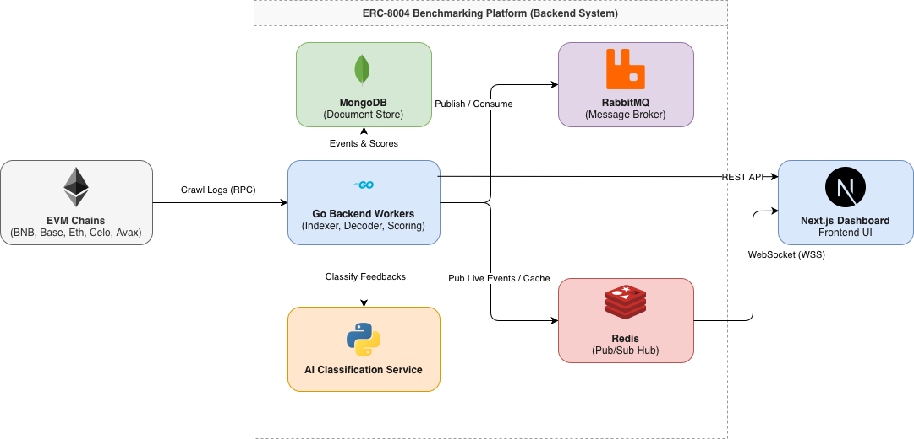
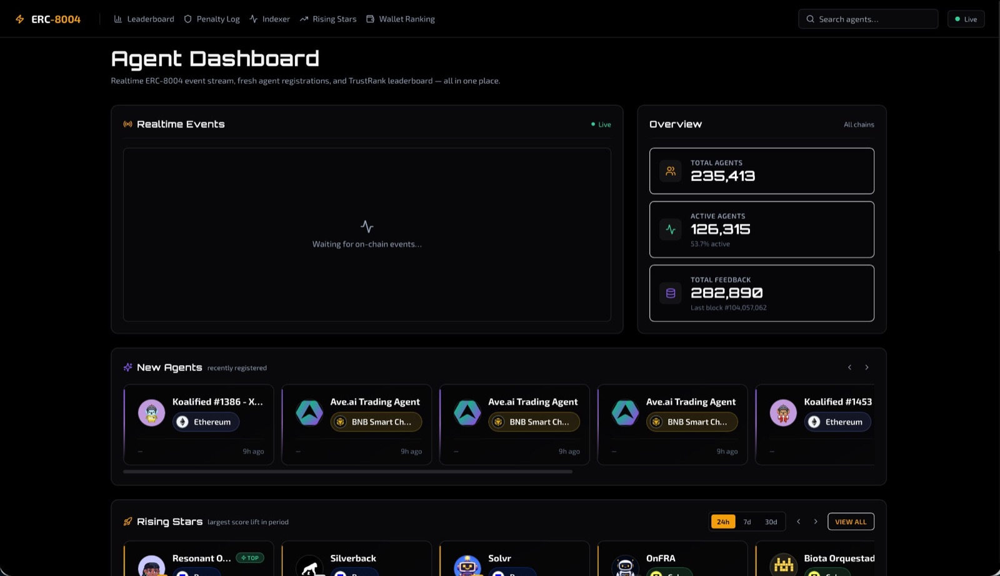
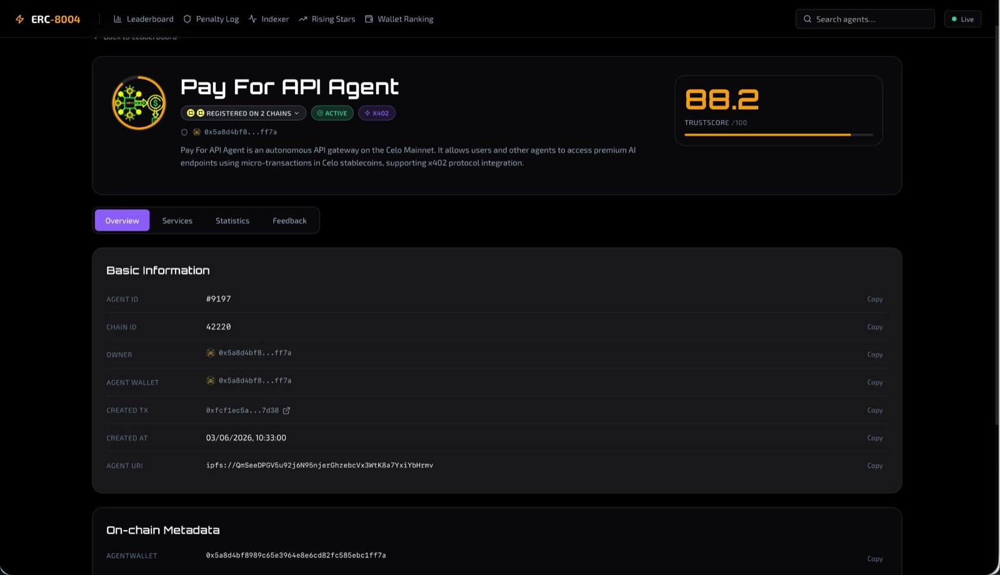
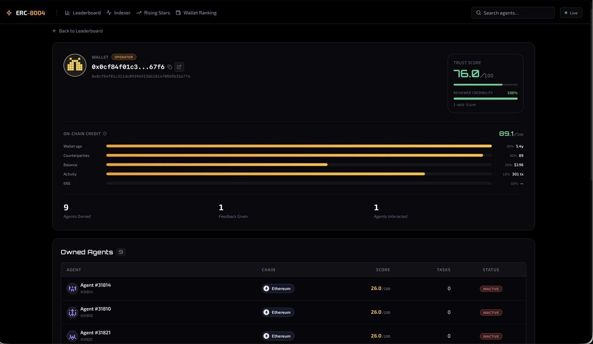

# ERC-8004 Agent Benchmarking & Reputation Platform

**Decentralized Benchmarking and Reputation Ranking System for AI Agents based on the ERC-8004 Standard**
Bachelor Thesis — Hanoi University of Science and Technology (SOICT), Global ICT Program
Author: [Hoàng Khải Mạnh](https://github.com/StrongDZ)

This repo is the project overview / index. The actual code lives in the three repos linked below. The full written thesis, defense deck, and supporting research artifacts are maintained separately and aren't public yet.

## Overview

Autonomous agents on Ethereum-compatible chains increasingly discover one another and exchange tasks and payments, yet a client has no neutral way to decide which agent to trust. [ERC-8004](https://eips.ethereum.org/EIPS/eip-8004) standardizes on-chain registries for agent identity and reputation but deliberately leaves the scoring of feedback off-chain — so existing block explorers and directories only expose raw, semantically ambiguous feedback, with no basis for a fair comparison across agents.

This project designs, implements, and evaluates a decentralized reputation-ranking platform for ERC-8004 agents, scoped to the Identity and Reputation registry paths. It interprets public, on-chain reputation signals into comparable trust rankings, benchmarking agents by their accumulated reputation evidence rather than by direct evaluation of task-execution capability.

An event-driven backend continuously crawls five EVM chains, decodes Identity and Reputation registry events, resolves off-chain metadata, and classifies each piece of feedback into one of four semantic categories (`junk`, `quantity`, `quality`, `others`) using a rule-based cascade with a language-model fallback. A reputation engine combines low-latency incremental updates with periodic authoritative replays: it weights each piece of feedback by the quality of its supporting evidence rather than an unreliable price signal, and bounds an agent's reputation with a Bayesian confidence factor so that scarce or unsubstantiated feedback is discounted. Per-agent reputation, a five-component composite score, and a WalletTrust credibility score for feedback-submitting wallets drive an interactive real-time dashboard with leaderboards, agent profiles, and a live event feed.

**Scale:** 1.25M+ on-chain events processed · 243,000+ agents indexed · 321,000+ feedback records classified · 5 EVM chains.

## Architecture

## Dashboard preview

Leaderboard with realtime events, agent profile, and wallet profile (WalletTrust). More screenshots in the [frontend repo](https://github.com/StrongDZ/erc-8004-benchmarking-fe#showcase).

| | |
|---|---|
|  |  |

## Repositories

| Repo | Role | Stack |
|---|---|---|
| [erc-8004-benchmarking-be](https://github.com/StrongDZ/erc-8004-benchmarking-be) | EVM event indexing & decoding, raw-log archive, feedback grading, reputation/WalletTrust scoring, REST + WebSocket API | Go, MongoDB, Redis, RabbitMQ, Redpanda, MinIO |
| [erc-8004-benchmarking-fe](https://github.com/StrongDZ/erc-8004-benchmarking-fe) | Realtime leaderboard, agent & wallet profiles, live event feed, operator console | Next.js 14, TypeScript, Tailwind CSS, ECharts |
| [erc-8004-ai-service](https://github.com/StrongDZ/erc-8004-ai-service) | Feedback-classification cascade (SVM → cosine → LLM) + classifier benchmarks | Python, FastAPI, scikit-learn, sentence-transformers, Ollama |

## Research contributions

- Extensive offline classifier research (benchmark/pipeline scripts) spanning classical ML (Naive Bayes), frozen sentence embeddings, zero-shot LLMs, and fine-tuned unified encoders (ModernBERT) — quantifying the accuracy/latency/cost trade-offs behind the production design. The production cascade reaches 0.814 two-class Macro-F1 (vs 0.810 for LLM-only) while sending ~62% fewer records to the LLM; the rule engine alone resolves ~92% of live feedback.
- A parameter sensitivity study (Sobol variance-decomposition, Tornado analysis) identifying which scoring constants most influence the resulting rankings.
- Validation Registry integration is scoped as future work.

## Author

**Hoàng Khải Mạnh** — Global ICT Program, Hanoi University of Science and Technology (HUST)
[GitHub](https://github.com/StrongDZ) · [hoanmanh04@gmail.com](mailto:hoanmanh04@gmail.com)
